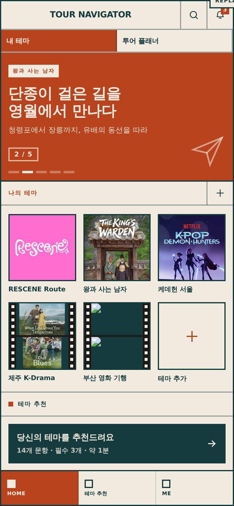

# Tour Navigator App

영상 속 장소를 따라 걷는 여행 계획 앱. 홈 화면 하나에서 다섯 개 테마와 통합 플래너로 들어갑니다.

## 메인 화면

`Tour Navigator Home.dc.html` 을 브라우저에서 연 모습입니다. 390×844 프레임 기준.

위에서부터 네 덩어리로 읽힙니다.

**1. 헤더** — `TOUR NAVIGATOR` 워드마크, 검색, 알림(읽지 않은 개수 배지). 바로 아래 **내 테마 / 투어 플래너** 두 탭이 붙어 있고, 선택된 탭은 주황 `#b8431c` 로 반전됩니다.

**2. 배너** — 5장이 자동 회전합니다. 각 장은 테마 라벨(`RESCENE ROUTE`), 두 줄 헤드라인, 한 줄 설명, `1 / 5` 카운터, 하단 진행 막대로 구성됩니다. 탭하면 해당 테마 화면으로 들어갑니다.

**3. 나의 테마** — 2열 타일. RESCENE Route · 왕과 사는 남자 · 케데헌 서울 · 제주 K-Drama · 부산 영화 기행, 그리고 마지막 칸은 **테마 추가**(`+`) 자리입니다. 섹션 헤더 오른쪽의 `+` 도 같은 동작입니다.

**4. 지금 인기 코스** — 가로 스크롤 카드. 카드마다 분류 라벨(`UNESCO`, `COAST`), 코스 이름과 일정(`경주 2박 3일`), 촬영지 수와 주 이동수단(`촬영지 9곳 · KTX`)이 적힙니다.

**하단 탭** — HOME / ALERT / ME. 선택된 탭만 주황으로 채워집니다.

색·타이포·괘선은 아래 [디자인](#디자인) 절의 Modernist 시스템을 그대로 따릅니다. 화면 전환은 페이지 이동 없이 같은 문서 안에서 일어납니다.

## 화면

| 화면 | 파일 | 내용 |
| --- | --- | --- |
| 홈 | `Tour Navigator Home.dc.html` | 자동 회전 배너 5장, 테마 타일, 인앱 전환 |
| 투어 플래너 | `Tour Planner.dc.html` | 전 테마 장소 299곳 통합, 도시 클러스터, 코스 계산 |
| RESCENE Route | `RESCENE Route.dc.html` | 경주·거제·전국 |
| 왕과 사는 남자 | `Kings Warden Route.dc.html` | 영월 |
| 케이팝 데몬 헌터스 | `KPop Demon Hunters Route.dc.html` | 서울 |
| 제주 K-Drama | `Jeju K-Drama Route.dc.html` | 제주 |
| 부산 영화 기행 | `Busan Cinema Route.dc.html` | 부산 |

## 기능

- **지도** — Google Maps, 카테고리 필터, 도시 단위 클러스터, 장소 상세(좌표 근거·운영시간·요금·사진)
- **코스** — 날짜 범위 선택(n박 m일), 출발지·도착지 지정, 하루 9~12시간 예산으로 동선 자동 생성, 이동 시간·거리 계산
- **교통** — KTX·SRT·고속버스·렌터카·항공(제주). 지역별 광역 관문에 따라 예매 버튼이 바뀜
- **숙박** — 동선 기준 25km 내 숙소 추천, 날짜가 채워진 예약 링크
- **다국어** — 한국어·English·中文·日本語·Español
- **유네스코** — 세계유산 등재 장소에 아이콘 표시

## 데이터

장소 좌표는 WGS84. 주소 기반 지오코딩과 위키백과 등재 좌표를 사용했고, 근거를 장소별 `srcKo`/`srcEn`에 기록했습니다. 사진은 위키미디어 커먼즈의 자유 이용 이미지입니다.

## 구조

각 화면은 Design Component(`.dc.html`) 한 파일입니다. 파일 안에 템플릿과 로직 클래스가 함께 들어 있고, 빌드 과정 없이 브라우저에서 바로 실행됩니다.

- `DATA` — 지역별 장소 배열
- `REGION_HUB` / `ORIGINS` / `TRANSIT` — 광역 교통 관문
- `STAYS` — 숙소 후보
- `I18N` — 중국어·일본어 레이어
- `class Component extends DCLogic` — 상태와 렌더 값

## 디자인

Modernist 디자인 시스템 기반. 실크스크린 팔레트(잉크 `#153b3d` / 주황 `#b8431c` / 크림 `#f2ece0`), Archivo + Gowun Dodum, 0px 라운드, 2px 괘선.

공통 CSS는 `shared.css` 한 파일이고, 각 화면이 `<helmet>` 에서 링크합니다. 구성은 [STYLES.md](STYLES.md) 참고.
