# Tour Navigator App

영상 속 장소를 따라 걷는 여행 계획 앱입니다. 영화 · 드라마 · 뮤직비디오에 나온 촬영지를 지도에 모으고, 고른 장소를 날짜 · 교통 · 숙소까지 이어지는 하루 단위 동선으로 바꿔 줍니다. 홈에서 다섯 개 테마 코스와 전국 통합 플래너로 들어가며, 빌드나 서버 없이 HTML 파일을 여는 것만으로 실행됩니다.

## 이런 문제를 풉니다

촬영지 여행은 정보가 흩어져 있습니다. 장소는 팬 블로그에, 운영시간은 관광공사에, 교통은 코레일 · 버스 · 항공 사이트에, 숙소는 OTA 에 따로 있습니다. 이 앱은 그 과정을 한 화면에서 끝내도록 만들었습니다.

1. **어디를** — 테마별 촬영지와 근처 명소를 지도와 목록으로 보고, 장면 · 영상과 함께 확인합니다.
2. **언제** — 달력에서 날짜를 고르면 하루 720분 예산 안에서 운영시간과 이동 시간을 맞춘 일정이 나옵니다.
3. **어떻게** — 출발지부터 광역교통 · 현지 이동까지 이어지는 경로와 시각표, 예매 링크가 붙습니다.
4. **어디서 자고** — 동선 근처 숙소 후보와 날짜가 채워진 예약 링크가 붙습니다.

## 한눈에 보기

| 항목 | 내용 |
| --- | --- |
| 화면 | 홈 1 · 투어 플래너 1 · 테마 5 (RESCENE Route · 왕과 사는 남자 · 케데헌 서울 · 제주 K-Drama · 부산 영화 기행) |
| 장소 | 플래너 2,711곳 · 109개 시군. 유네스코 69 · 한국관광 100선 99 · 열린관광지 99 · 관광특구 등 210곳에 배지 |
| 언어 | 한국어 · English · 中文 · 日本語 · Español (플래너는 Français 추가) |
| 외부 데이터 | 한국관광공사 · 기상청 · 에어코리아 · 국토부 TAGO · 한국공항공사 · 부산시 · 카카오 · Google Maps · YouTube · TMDB |
| 구성 | 정적 HTML 7개 + 공용 JS · CSS. 서버 · DB · 빌드 없음. 사용자 데이터는 브라우저에만 저장 |
| 오프라인 도구 | 테마 추천 계산(Python), 체류 시간 산정(Node), 시스템 구성도 · 명세서 생성 |

## 빠른 시작

```bash
git clone https://github.com/TourLabOrganization/Tour-Navigator-App.git
cd Tour-Navigator-App
cp config.example.js config.js     # 키를 채우거나, 비워 둔 채로 실행
python3 -m http.server 8000
```

브라우저에서 `http://localhost:8000/Tour%20Navigator%20Home.dc.html` 을 엽니다. 파일을 더블클릭해 `file://` 로 열면 화면은 뜨지만 외부 API 호출이 막힙니다.

키 없이도 장소 목록 · 코스 계산 · 예매 링크 · 내 플랜 · 스탬프는 동작합니다. 지도 타일, 날씨, 시각표 같은 기능을 켜려면 키가 필요하며 발급처와 활용신청 목록은 [APIS.md](APIS.md) 에 있습니다. `config.js` 는 `.gitignore` 에 올라 있어 커밋되지 않습니다.

## 사용 흐름 예시 — 거제 1박 2일

1. 홈의 **RESCENE Route** 타일을 누르고 상단에서 **거제** 탭을 고릅니다. 촬영지 14곳이 지도와 목록에 뜹니다.
2. **바람의 언덕**을 열면 운영시간 · 권장 체류(1시간) · 좌표 근거와 "함께 많이 가는 관광지"가 나옵니다. **코스에 추가**를 누릅니다. 매미성 · 해금강도 같은 방식으로 넣습니다.
3. **코스** 탭에서 달력의 출발일과 귀가일을 차례로 고르면 1박 2일로 나뉩니다.
4. 광역교통으로 **버스**를 고르고 출발지를 서울남부터미널(시외버스) 또는 센트럴시티터미널(고속버스)로 정하면, 고현버스터미널까지의 경로와 탈 수 있는 첫 편 시각이 붙습니다.
5. 현지 이동을 렌트카 또는 대중교통으로 고르면 하루 단위 카드가 만들어집니다. 카드마다 도착 시각 · 체류 · 다음 장소까지 이동 시간이 있고, 1일차 밤에는 근처 숙소 후보와 예약 링크가 붙습니다.
6. 이름을 붙여 **코스 저장**하면 홈 ME 의 "저장된 플랜"에서 다시 엽니다. 현장에서는 장소마다 **스탬프 찍기**로 방문을 기록합니다.

## 메인 화면

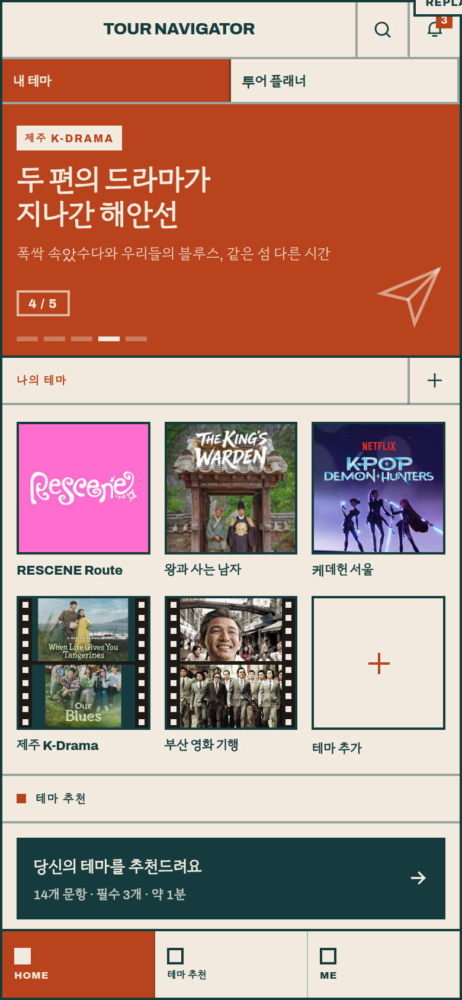

`Tour Navigator Home.dc.html` 을 브라우저에서 연 모습입니다. 390×844 프레임 기준.

위에서부터 다섯 덩어리로 읽힙니다.

**1. 헤더** — `TOUR NAVIGATOR` 워드마크, 검색, 알림(읽지 않은 개수 배지). 바로 아래 **내 테마 / 투어 플래너** 두 탭이 붙어 있고, 선택된 탭은 주황 `#b8431c` 로 반전됩니다.

**2. 배너** — 5장이 자동 회전합니다. 각 장은 테마 라벨(`RESCENE ROUTE`), 두 줄 헤드라인, 한 줄 설명, `1 / 5` 카운터, 하단 진행 막대로 구성됩니다. 탭하면 해당 테마 화면으로 들어갑니다.

**3. 나의 테마** — 3열 타일. RESCENE Route · 왕과 사는 남자 · 케데헌 서울 · 제주 K-Drama · 부산 영화 기행, 그리고 마지막 칸은 **테마 추가**(`+`) 자리입니다. 섹션 헤더 오른쪽의 `+` 도 같은 동작입니다.

**4. 지금 인기 코스** — 가로 스크롤 카드. 카드마다 분류 라벨(`UNESCO`, `COAST`), 코스 이름과 일정(`경주 2박 3일`), 촬영지 수와 주 이동수단(`촬영지 9곳 · KTX`)이 적힙니다.

**5. 테마 추천** — "당신의 테마를 추천드려요" 카드. 14개 문항으로 여행자 유형을 판정합니다.

**하단 탭** — HOME / 테마 추천 / ME. 선택된 탭만 주황으로 채워집니다.

색·타이포·괘선은 [DESIGN.md](DESIGN.md) 의 Modernist 시스템을 그대로 따릅니다. 화면 전환은 페이지 이동 없이 같은 문서 안에서 일어납니다.

## 화면 둘러보기

캡처는 헤드리스 브라우저에서 찍었고 외부 API 응답은 예시 값입니다. Google Maps 는 키 없이는 타일을 내려주지 않아 지도 영역이 비어 있으며, 지도 탭 캡처는 키가 있는 환경에서 찍어 `assets/screenshots/map-*.png` 로 넣을 자리입니다. 각 화면의 실제 동작은 아래 [기능 상세](#기능-상세) 에 있습니다.

<table>
<tr>
<td align="center">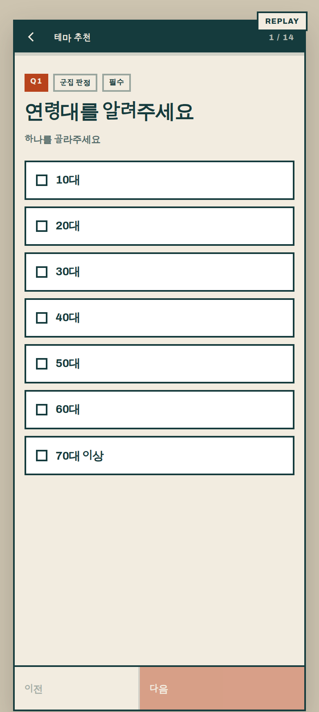<br><sub>홈 · 테마 추천 (14문항)</sub></td>
<td align="center">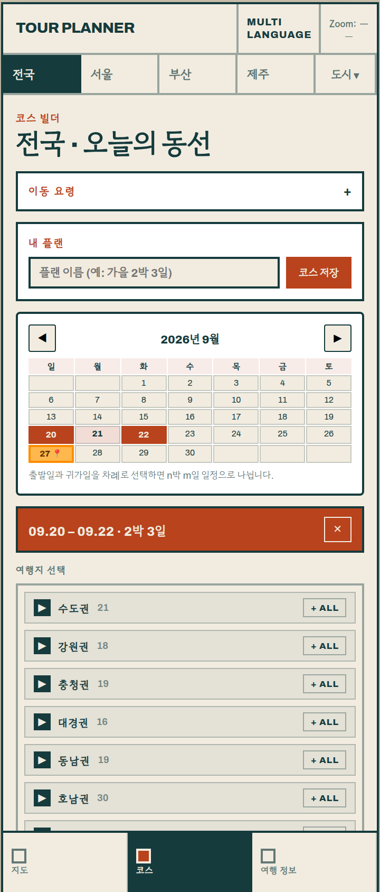<br><sub>플래너 · 코스 빌더 (날짜 → n박 m일, 권역별 여행지)</sub></td>
<td align="center">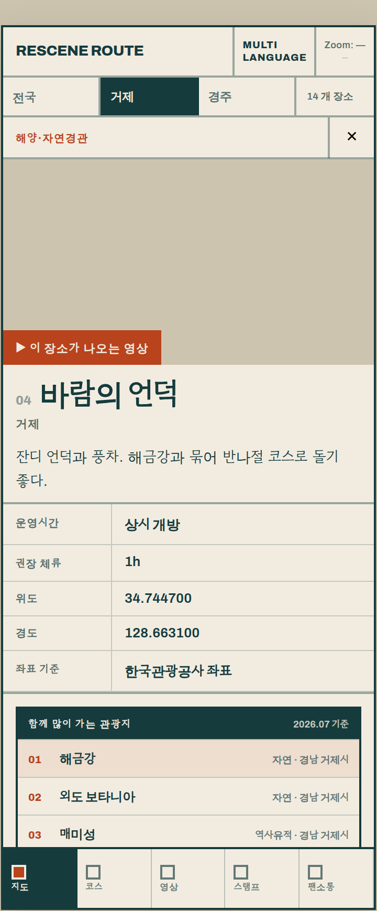<br><sub>테마 화면(RESCENE Route · 거제) · 장소 상세</sub></td>
</tr>
<tr>
<td align="center">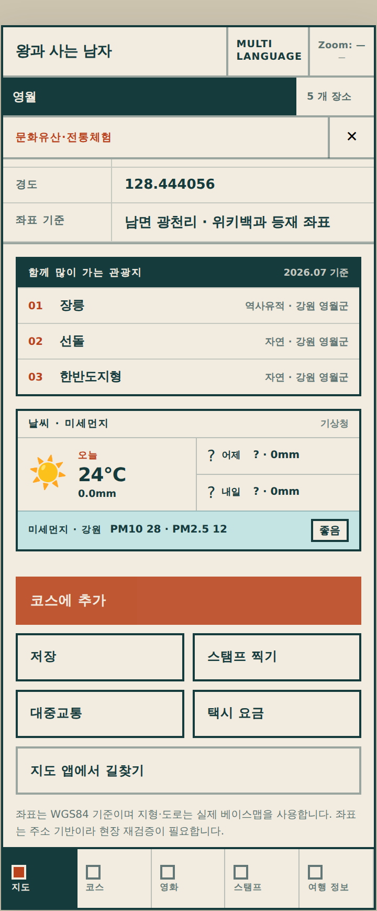<br><sub>장소 상세 아래쪽 · 함께 많이 가는 관광지 · 날씨 · 미세먼지</sub></td>
<td align="center">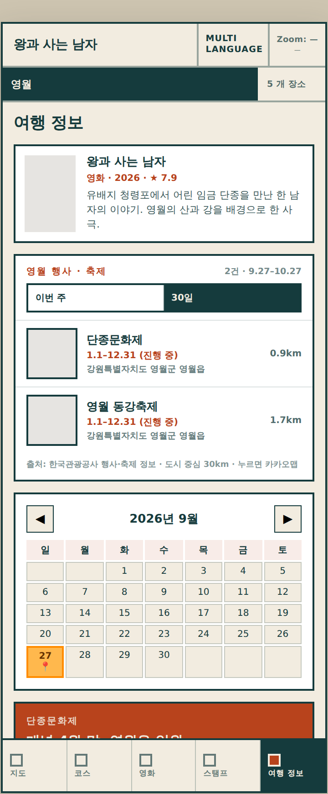<br><sub>팬소통 탭 · 거제 행사 · 축제</sub></td>
<td align="center">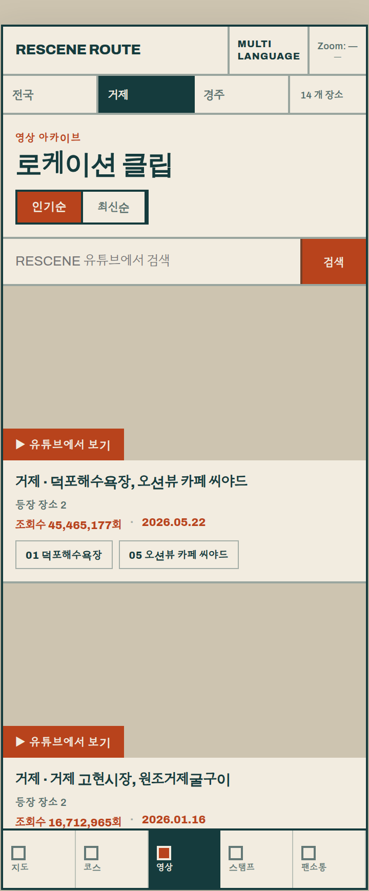<br><sub>영상 탭 · 장면별 촬영지</sub></td>
</tr>
<tr>
<td align="center">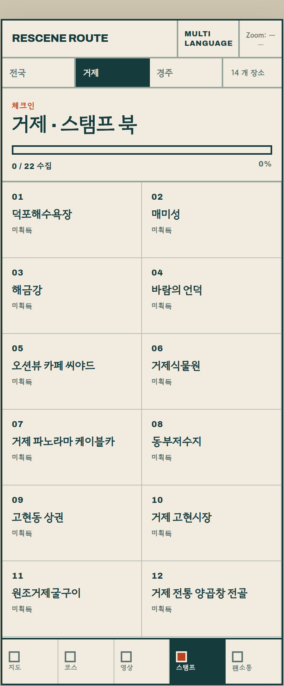<br><sub>스탬프 북 (거제 22곳)</sub></td>
<td></td><td></td>
</tr>
</table>

### 관광지별 정보

테마마다 장소 상세의 표 항목이 조금씩 다릅니다. 전화번호가 있는 곳은 전화 행이, 유네스코 세계유산은 이름 옆에 배지가 붙습니다.

<table>
<tr>
<td align="center"><br><sub>부산 영화 기행 · 감천문화마을 (운영시간 · 요금 · 전화 · 작품)</sub></td>
<td align="center">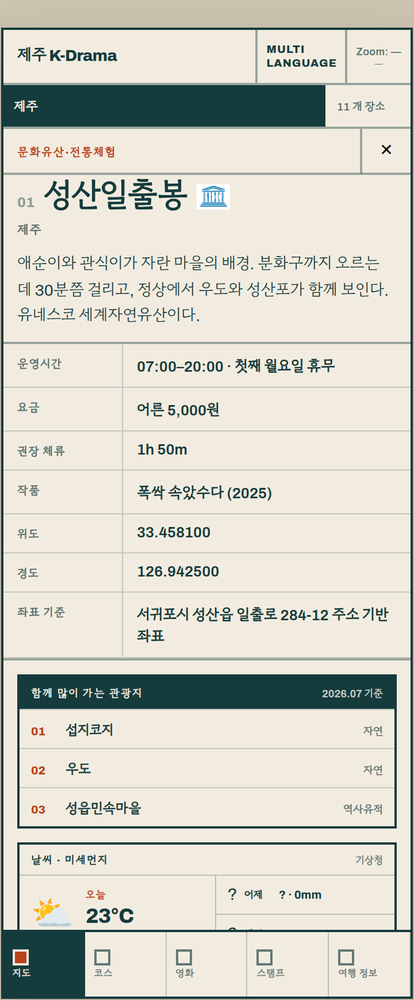<br><sub>제주 K-Drama · 성산일출봉 (유네스코 배지 · 연관 관광지 · 날씨)</sub></td>
<td align="center">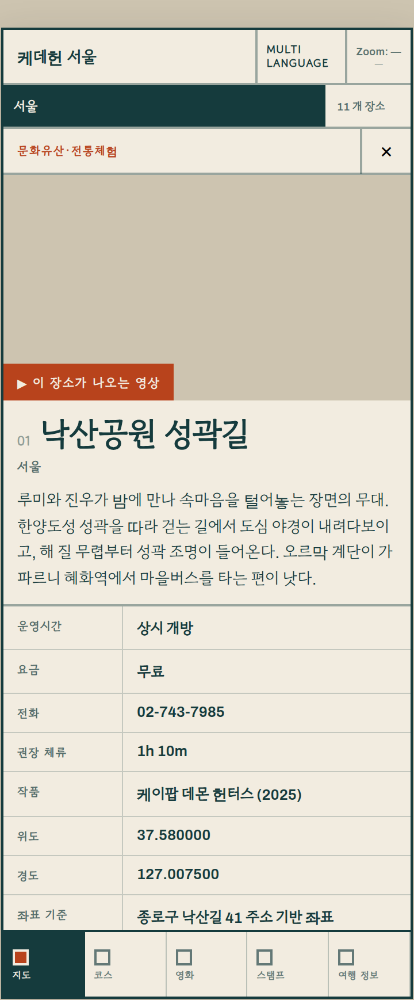<br><sub>케데헌 서울 · 낙산공원 성곽길 (장면 설명 · 접근 팁)</sub></td>
</tr>
<tr>
<td align="center">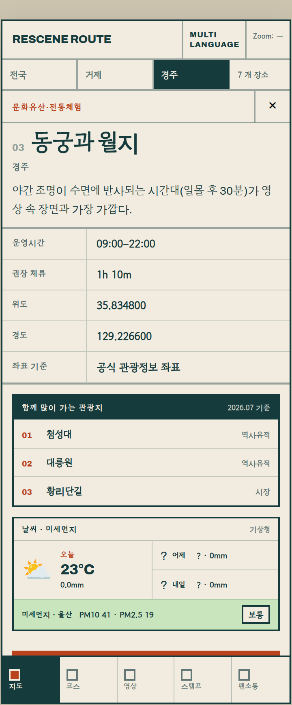<br><sub>RESCENE Route · 경주 동궁과 월지 (연관 관광지 · 미세먼지 등급)</sub></td>
<td></td><td></td>
</tr>
</table>

## 화면

| 화면 | 파일 | 내용 |
| --- | --- | --- |
| 홈 | `Tour Navigator Home.dc.html` | 자동 회전 배너 5장, 테마 타일, 테마 추천(14문항 → 여행자 유형), ME 화면(나의 테마 · 저장 플랜), 인앱 전환 |
| 투어 플래너 | `Tour Planner.dc.html` | 전국 장소 2,711곳 · 109개 시군 통합, 도시 클러스터, 코스 계산, 광역교통 2단계 선택 · 이동 체인 · 시각표, 지하철 호선·역 선택, 내 플랜 저장 |
| RESCENE Route | `RESCENE Route.dc.html` | 경주·거제·전국 |
| 왕과 사는 남자 | `Kings Warden Route.dc.html` | 영월 |
| 케이팝 데몬 헌터스 | `KPop Demon Hunters Route.dc.html` | 서울 |
| 제주 K-Drama | `Jeju K-Drama Route.dc.html` | 제주 |
| 부산 영화 기행 | `Busan Cinema Route.dc.html` | 부산 |

테마 화면 5종은 같은 구조입니다. 하단 탭은 **지도 · 코스 · 영화 · 스탬프 · 여행 정보** 다섯 개이고, RESCENE 은 뮤직비디오 테마라 **영상** · **팬소통** 으로 이름이 바뀝니다. 플래너는 **지도 · 코스 · 여행 정보** 세 개입니다.

## 기능 상세

### 홈

- **배너와 타일** — 배너 5장이 자동 회전하며 탭하면 해당 테마로 들어갑니다. "나의 테마" 타일 5개와 **테마 추가** 자리, "지금 인기 코스" 가로 카드(경주 2박 3일 · 거제 1박 2일 등)가 이어집니다.
- **테마 추천** — 14개 문항(필수 3개, 약 1분)에 답하면 여행자 유형을 판정하고 추천 테마를 보여줍니다. Q1~Q9 는 유형 판정, Q10~Q14 는 코스 필터입니다. 결과는 브라우저에 저장되어 ME 화면의 "나의 여행자 유형"에 남고, "다시 추천받기"로 다시 할 수 있습니다. 점수표의 근거는 [테마 추천 알고리즘/](테마%20추천%20알고리즘/README.md) 에 있습니다.
- **ME** — 나의 테마, 저장된 플랜, 나의 여행자 유형. 상단에는 검색과 알림(읽지 않은 개수) 아이콘이 있습니다.

### 지도와 장소 목록

- Google Maps 위에 도시 단위 클러스터와 카테고리 마커를 그립니다. 마커 아이콘은 한 번 만든 것을 재사용합니다.
- 상단 도시 탭(전국 · 서울 · 부산 · 제주 · 도시 ▾)과 카테고리 칩(숙박 · 문화유산·전통체험 · 로컬상권·먹거리 · 테마파크·액티비티 · 해양·자연경관 · 힐링·생태·체험)으로 거릅니다. 유네스코 · 한국관광 100선 · 열린관광지 · 관광특구 배지도 필터가 됩니다.
- 목록은 첫 화면에 40곳을 보여주고 **더 보기**로 늘립니다. 각 줄에 분류와 권장 체류 시간이 붙습니다.
- 플래너에서는 **지도에서 검색해 추가**로 목록에 없는 장소를 Kakao 로컬 검색으로 찾아 코스에 넣을 수 있습니다.

### 장소 상세

- 이름 · 설명 · 운영시간 · 요금 · 권장 체류 · 작품 · 위도 · 경도 · 좌표 근거를 표로 보여줍니다. 좌표는 WGS84 이고 근거(`srcKo` / `srcEn`)를 그대로 노출합니다.
- 공공데이터포털 키가 있으면 좌표 기준으로 한국관광공사 DB 를 조회해 공식 표기 · 운영시간 · 요금 · 사진 · 오디오 가이드 · 스토리텔링을 채웁니다.
- **함께 많이 가는 관광지** — 한국관광공사 연관 관광지 통계에서 같은 시군구의 상위 8곳을 순위 · 분류 · 지역과 함께 보여줍니다. 목록에 있는 장소면 탭해서 바로 엽니다.
- **날씨 · 미세먼지** — 오늘 최고기온 · 강수 · 하늘(기상청 단기예보, 없으면 Open-Meteo), 어제 · 내일 요약, 시도별 PM10 · PM2.5 와 4단계 등급.
- 버튼: **코스에 추가**, **저장**(북마크), **스탬프 찍기**, **대중교통**, **택시 요금**(카카오모빌리티 실측), **지도 앱에서 길찾기**.
- **▶ 이 장소가 나오는 영상** — 장소가 등장하는 YouTube 영상으로 연결합니다.

### 코스 빌더 (플래너 · 테마 화면 코스 탭)

- **날짜** — 달력에서 출발일과 귀가일을 차례로 고르면 n박 m일로 나뉩니다. 하루 예산은 720분(09:00–21:00)이고, 첫날은 출발 시각과 광역 접근 시간만큼, 마지막 날은 귀가 시각만큼 줄어듭니다.
- **여행지 선택** — 권역(수도권 · 강원권 · 충청권 · 대경권 · 동남권 · 호남권 · 제주권)별로 펼쳐 고르거나 **+ ALL** 로 권역 전체를 넣습니다. **추천 코스 불러오기**로 테마 기본 코스를 넣을 수도 있습니다.
- **자동 동선** — 선택 장소를 도시 단위로 묶고, 도시 안에서는 좌표 기준 최근접 순서로 돌며 체류 시간을 더합니다. 이동 시간은 자동차 구간이면 카카오모빌리티 실측, 없으면 직선거리 × 1.35 에 수단별 식을 씁니다. 도착 시각은 이동 → 개장 대기 → 체류 순으로 쌓이고, 폐장 전에 체류를 못 마치는 후보는 건너뜁니다. 체류 시간은 장소마다 바꿀 수 있습니다.
- **일자별 카드** — 하루씩 잘라 카드로 보여주고, 구간마다 이동 수단 · 시간 · 거리 · 예매 버튼을 붙입니다. **이 날에 넣을 장소 검색**으로 특정 날짜에 장소를 끼워 넣습니다.
- **이동 요령** — 접이식 안내 6단계로 광역교통 → 출발지 · 귀가지 → 경로 선택 → 현지 이동 → 숙소 → 제주 규칙을 설명합니다.
- 산정 규칙과 식은 [체류시간 산정/README.md](체류시간%20산정/README.md) 에 정리되어 있습니다.

### 교통

- **광역교통 먼저** — 버스 · 기차 · 항공 · 배 · 지하철 · 자가용 중 하나를 고르면 그 수단에 맞는 터미널 · 역 · 공항 · 항만만 출발지 · 귀가지 후보로 나옵니다. 출발 시각과 귀가 출발 시각을 따로 정합니다.
- **이동 체인** — 출발지 → 환승 관문 → 도착 관문으로 이어지는 경로를 계산하고, 집에서 터미널 · 역까지 가는 구간도 포함합니다. KTX / 고속버스처럼 경로가 둘 이상이면 안내 창에서 고릅니다.
- **시각표** — 국토교통부 TAGO 열차 · 고속버스 시각표에서 "내 출발 시각 기준 탈 수 있는 첫 편"을 보여줍니다. 부산도시철도는 부산교통공사 시각표를 씁니다.
- **지하철** — 수도권 주요 역 165개를 호선 → 역명 순으로 고르고, 목록에 없는 역은 이름 검색으로 추가해 기기에 저장합니다. 서울열린데이터광장 실시간 도착 정보를 붙입니다. 도시철도는 서울 · 부산 · 인천.
- **항공** — 국내선 9개 공항. 김해 · 제주 등 노선 운항 현황(실적 기반)과 한국공항공사 공항 수속 소요시간(신분확인 → 보안검색 → 탑승)으로 공항 도착 여유를 계산합니다. 편성 요약은 `KAC_ENDPOINT` 를 넣기 전까지 하드코딩 값입니다.
- **배 · 자가용** — 제주는 항공 · 배 · 자가용(도민 또는 카페리)만 고를 수 있고, 여객선은 제주 · 울릉 시간표를 씁니다. 자가용을 고르면 "출발 방식 확인" 카드가 뜨고 현지에서도 같은 차로 이동합니다. 고속도로 휴게소 목록(한국도로공사)과 렌트카 예매 링크가 붙습니다.
- **예매 링크** — 코레일 · SRT · 티머니 고속/시외버스 · 네이버 항공 · 해운 여객선 · 렌터카(롯데 · SK · 쏘카 · Rentalcars) · 카카오T. 날짜와 검색어를 URL 에 채워 새 창으로 엽니다.

### 숙박

- 1박 이상이면 날짜마다 동선 25km 안의 숙소 후보(STAYS)를 추천하고 Booking · Agoda · Airbnb · 야놀자 · 여기어때 · Trip.com 예약 링크에 날짜를 채워 붙입니다. 숙박 장소는 관광 시간 계산에서 빠집니다.

### 내 플랜 · 저장 · 스탬프

- **내 플랜** — 코스에 이름을 붙여 **코스 저장**하고, 저장소에서 불러오기 · 덮어쓰기 · 삭제합니다. 플래너와 테마 5종 모두에서 되며 브라우저(localStorage)에 남습니다. 홈 ME 의 "저장된 플랜"에서도 봅니다.
- **저장한 장소** — 장소 상세의 **저장**으로 북마크한 장소 목록. 스탬프 탭 아래쪽에 있습니다.
- **스탬프 북** — 테마 도시의 장소마다 칸이 있고 **스탬프 찍기**는 현재 위치(HTTPS 에서만)를 확인해 찍습니다. 수집 진행률을 막대로 보여줍니다.

### 영화 속 장면 (테마 화면 · 영화 / 영상 탭)

- 영화 · 드라마 테마는 작품의 장면을 순서대로(장면순 · 역순) 나열하고, 장면마다 등장 장소와 **▶ 장면 찾아보기**(YouTube 검색)를 붙입니다. RESCENE 은 로케이션 클립을 인기순 · 최신순으로 나열하고 조회수 · 게시일 · 등장 장소를 보여줍니다. 장면 · 장소 검색이 됩니다.
- 영상 채널은 지연 로드하고, YouTube 조회수 · 게시일은 하루 1회 갱신해 캐시합니다(YouTube 키 필요).

### 여행 정보 (여행 정보 탭)

- **작품 카드** — TMDB 에서 영화 · 드라마 포스터 · 개봉년 · 평점 · 줄거리를 가져옵니다(TMDB 키 필요, 7일 캐시).
- **지역 행사 · 축제** — 도시 중심 30km 안의 한국관광공사 행사를 "이번 주 / 30일"로 나눠 거리와 함께 보여주고, 누르면 카카오맵으로 엽니다. 플래너 코스 탭에는 여행 기간에 열리는 행사가 따로 붙습니다.
- 달력, 지역 대표 축제 안내, 지역 관광 안내 링크. RESCENE 화면은 이 탭이 **팬소통 채널**이고 작품 카드 대신 영상 아카이브 링크가 있습니다. 부산 화면은 부산시 테마여행정보(도보여행 · 이색여행 241곳)를 함께 보여줍니다.

### 다국어

- 한국어 · English · 中文 · 日本語 · Español. 플래너는 Français 도 지원합니다(UI 라벨 65개는 아직 영어, [I18N-TODO.md](I18N-TODO.md)).
- 장소명 · 운영시간 · 분류는 한국관광공사 다국어 DB 의 공식 표기를 쓰며, 선택 언어 DB → 영어 DB → 내장 한국어 순으로 떨어집니다.

### 키 없이 실행하면

`config.js` 의 키가 비어 있으면 해당 기능만 조용히 꺼지고 나머지는 동작합니다. 지도 타일 · 공사 DB · 날씨(기상청) · 미세먼지 · 행사 · 연관 관광지 · 시각표 · 작품 카드 · 조회수가 그 대상이고, 장소 목록 · 코스 계산 · 예매 링크 · 내 플랜 · 스탬프는 키 없이도 됩니다. 키 목록은 [APIS.md](APIS.md).

## 기술 구성

| 층 | 내용 |
| --- | --- |
| 화면 | Design Component 파일(`.dc.html`) 7개. 한 파일에 템플릿 · 데이터 · 로직 클래스가 함께 있음 |
| 런타임 | `support.js` 가 브라우저에서 템플릿을 React 컴포넌트로 컴파일. React 18.3 · Babel standalone 을 unpkg CDN 에서 받음 |
| 공용 코드 | `shared.js` — 키 읽기, 색 · 라벨, 날씨 · 미세먼지 · 행사 · 연관 관광지 · 작품 조회 함수. `shared.css` — 공통 스타일 |
| 설정 | `config.js` — API 키 6개. 화면은 키를 직접 읽지 않고 `shared.js` 상수만 씀 |
| 저장 | `localStorage` — 내 플랜 · 테마 추천 결과 · 추가한 역 · 시각표 캐시 |
| 설계 | Claude Design 에서 화면을 설계하고 내보내기본을 통합 스크립트로 반영 ([CLEANUP.md](CLEANUP.md)) |

구조와 로드 순서는 [ARCHITECTURE.md](ARCHITECTURE.md), 시스템 전체 그림은 [시스템 구성도](시스템%20구성도/README.md) 에 있습니다.

## 알려진 제약

- **숙소는 샘플 데이터입니다.** 후보로 OTA 검색 링크를 만들 뿐, 가격이나 빈 방을 보장하지 않습니다.
- **항공 편성은 참고값입니다.** 한국공항공사 운항 API 주소(`KAC_ENDPOINT`)를 넣기 전까지 제주 · 부산 노선은 하드코딩 요약입니다.
- **키는 브라우저에 노출됩니다.** 정적 앱이라 `config.js` 의 키는 사용자에게 보입니다. Google · Kakao 키는 반드시 도메인 제한을 겁니다.
- **CDN 에 의존합니다.** unpkg 가 막히면 화면이 뜨지 않습니다.
- **제주 사진 일부가 HTTP 주소입니다.** HTTPS 로 배포하면 브라우저가 막습니다.
- **플래너가 무겁습니다.** `Tour Planner.dc.html` 이 장소 데이터를 품고 있어 2.0MB 입니다.
- **저장은 기기마다 따로입니다.** 내 플랜과 스탬프는 서버 없이 브라우저에만 남습니다.

남은 일은 [ROADMAP.md](ROADMAP.md) 에 있습니다.

## 폴더

```
*.dc.html                 화면 7개
support.js · shared.js · shared.css · image-slot.js · config.example.js
assets/                   장소 마스터 CSV · 배지 이미지 · README 캡처
uploads/                  홈 배너 · 테마 타일 이미지
테마 추천 알고리즘/         선호 문항 → 군집 → 추천 테마 계산 (Python)
체류시간 산정/             체류 · 일정 로직 모듈, 장소별 체류 CSV, 설명서
시스템 구성도/             구성도 PNG · 구성 명세서 docx · 생성 스크립트
```

## 데이터 출처

한국관광공사 TourAPI · 관광 데이터랩, 기상청, 한국환경공단 에어코리아, 국토교통부 TAGO, 한국공항공사, 부산광역시 · 부산교통공사, 서울열린데이터광장(공공데이터포털 이용), 위키미디어 커먼즈 이미지(각 레코드의 `imgCredit`), 제주 브랜드 콘텐츠 이미지, TMDB(작품 정보, TMDB 가 보증하지 않음), 2025 국민여행조사 · 외래관광객조사(테마 추천 근거). 좌표 근거는 장소마다 `srcKo` / `srcEn` 에 적었습니다. 작품 포스터 · 로고 이미지의 권리는 각 권리자에게 있습니다.

## 기여

실행 · 코드 규칙 · 커밋 전 점검 명령은 [CONTRIBUTING.md](CONTRIBUTING.md) 에 있습니다. 작업은 기능 브랜치에서 하고 PR 로 `main` 에 합칩니다. Claude Design 내보내기본은 GitHub 웹에 올리지 말고 작업 세션에 첨부합니다.

## 문서

| 문서 | 내용 |
| --- | --- |
| [ARCHITECTURE.md](ARCHITECTURE.md) | 파일 구성, 화면 내부 구조, 플래너 데이터 모델, 코스 계산 흐름 |
| [DATA.md](DATA.md) | 장소 데이터 규모 · 원본 파일 · 레코드 형식 · 배지 기준 |
| [APIS.md](APIS.md) | 외부 API 목록, 키 설정, CORS 제약 |
| [DESIGN.md](DESIGN.md) · [STYLES.md](STYLES.md) | Modernist 디자인 규칙과 CSS 구성 |
| [CONTRIBUTING.md](CONTRIBUTING.md) | 실행 방법, 키 설정, 코드 규칙 |
| [ROADMAP.md](ROADMAP.md) · [CHANGELOG.md](CHANGELOG.md) | 남은 일과 변경 기록 |
| [CLEANUP.md](CLEANUP.md) | 저장소 정리 기록과 재발 방지 규칙 (내보내기본 반영 절차 · 업로드 금지) |
| [테마 추천 알고리즘/README.md](테마%20추천%20알고리즘/README.md) | 선호 문항 → 군집 → 추천 테마 계산 (Python) |
| [시스템 구성도/README.md](시스템%20구성도/README.md) | 시스템 구성도 PNG · 구성 명세서 docx · 생성 스크립트 |
| [체류시간 산정/README.md](체류시간%20산정/README.md) | 체류 · 일정 시간 산정 로직, 장소별 체류 CSV, 설명서 |
